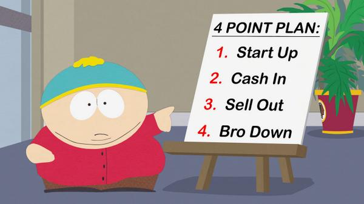

# Billboards

Travis Status\

## Project Information

## Project Description

Billboards is designed with the customers in mind first by bringing digital advertising straight to their mobile devices. The ideal audience is for mall and brick & mortars to onboard / register stores or products and using beacon technology notify customers within reach of products on sale at a given store.

Often times as consumers we will walk right pass stores that may have things on sale and not know simply because we were looking the other way, distracted, etc. With Billboards, customers will no longer miss out on a promotion for a given store if with range of a the beacon.

Quality of life improvements will be made to the shopper along with value in revenue will be generated for a given shop  or owner of the program at a given shopping center.

## Built With

* [React Native](https://www.npmjs.com/package/react-native-cli) - Native rendering mobile apps
* [React Navigation](https://www.npmjs.com/package/react-navigation) - Create navigable pages within a mobile app
* [Axios](https://www.npmjs.com/package/axios) - Promise based HTTP client for the browser and node.js

## Members

* Peter Huynh || [huynhpeter](https://github.com/huynhpeter) || Peter Huynh
* Mike Gross || [grossmi4](https://github.com/grossmi4) || Mike G
* Darron Biles || [DBiles](https://github.com/DBiles) || DBiles - Frontend UI/UX, Product Integration
